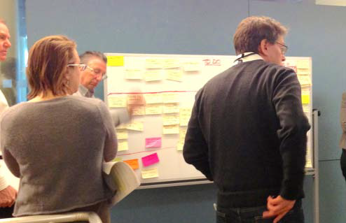

# Глава 3: Переход на LeSS

## Содержание

[Введение](#введение)

- [Однокомандный Скрам](#однокомандный-скрам)

[Переход на LeSS](#переход-на-less)

- [Руководство: Три Принципа Перехода на LeSS](#руководство-три-принципа-перехода-на-less)
- Guide: Getting Started
- Guide: Culture Follows Structure
- Guide: Job Safety but not Role Safety
- Guide: Organizational Perfection Vision
- Guide: Continuous Improvement
- Guide: Growing Your Adoption

LeSS Huge

- Guide: Evolutionary Incremental Adoption
- Guide: One Requirement Area at a Time
- Guide: Parallel Organizations



_Менеджеры обдумывают улучшения_

## Введение

> Если ты не меняешь направление, то можешь оказаться там, куда направляешься.
>
> — Лао-цзы

### Однокомандный Скрам

Скрам прост. Переход на Скрам — нет. Почему так?

Скрам - это не процесс. Он не решает все ваши проблемы и не создаёт "гиперпродуктивные" команды по взмаху волшебной палочки<sup>[33](#33)</sup>. Это фреймворк, который создаёт короткие циклы обратной связи, радикально повышающие прозрачность. Он работает как зеркало, показывающее команде, насколько они хороши в создании продукта. Он также выявляет проблемы в команде и организации. Такая прозрачность подкрепляет эмпирический контроль процесса, который наряду с циклами инспекции и адаптации помещает команду, Владельца Продукта и организацию в непрерывный цикл совершенствования.

Это хорошая новость. Плохая новость в том, что это жесть. На самом деле прозрачность вызывает дискомфорт или даже _пугает_, что делает переход на Скрам трудным.

Однокомандный Скрам мало что говорит о переходе на Скрам, кроме как начать "по книге". Не потому, что фанатики Скрама хотят заставить мир следовать их любимым правилам, а потому что признано, что улучшение начинается со следования стандартам и их понимания. Та же мысль отражается и в бережливом мышлении: "Там, где нет стандартов, не может быть и kaizen<sup>[34](#34)</sup>". Использование Скрама по книге даёт понимание того, как принципы и практики Скрама связаны между собой - с точки зрения системного мышления. Это крайне важно для успешности Скрама.

Опытный Скрам-мастер и команда с глубоким понимаем Скрама значительно повысят вероятность того, что вы добьётесь успеха.

## Переход на LeSS

Переход на LeSS вовлекает большие организации и большое количество умов, в которых уже укоренились убеждения, как эти организации _должны_ работать. Успешный переход требует _поставить под сомнения эти убеждения_ и _упростить структуру организации_, что при работе в большой группе людей приводит к решениям, вызывающим много гнева, недовольства и "потерю лица". Переход на LeSS требует от всех улучшения на пути к общей цели.

При масштабировании принципы перехода на LeSS включают в себя:

**Непрерывное улучшение на пути к совершенству** --- Как правило, продуктовая группа, переходящая на LeSS, предлагает свои убеждения и привычки, связанные с переходом. Какие именно? Создайте видение изменений и запустите много проектов по изменениям. Когда начальная цель, _по-видимому_, достигнута, то:

1. “изменение выполнено”, и
2. организация приспосабливается к новому статусу-кво, до тех пор пока
3. не появляется следующее изменение, которое затем
4. отменяет предыдущее изменение.

Этот классический подход похож на последовательный подход в разработке программ "большими порциями (big batches)", при котором _изменение является исключением_, строго управляемым… _множественными_ комиссиями по контролю изменений.

В LeSS не существует инициатив по изменениям, групп по изменениям, нет менеджеров по изменениям. В LeSS изменения происходят непрерывно путём экспериментов и улучшений, _изменения в LeSS являются статусом-кво_.

### Правила LeSS

````Установите LeSS-структуру во всей продуктовой группе с самого начала – это критически важно для перехода на LeSS. Для остальной части организации за пределами продуктовой группы переходите на LeSS эволюционно, используя подход Пойди и Посмотри (Go See) для создания организации, в которой экспериментирование и совершенствование – это норма.````

### Руководство: Три Принципа Перехода на LeSS

Эти принципы — ключевые при переходе на LeSS:

- глубоко и узко, а не широко и поверхностно
- сверху вниз (top-down) и снизу вверх (bottom-up)
- работа с волонтёрами

#### Глубоко и Узко, а не Широко и Поверхностно

Предпочтите качественный переход на LeSS в одной продуктовой группе<sup>[35](#35)</sup> поверхностному применению LeSS во многих.

Некачественный переход на LeSS только вредит. Отсутствие глубокого понимания разрушает прозрачность и циклы обратной связи, которые являются ключом к эмпирическому управлению и постоянному совершенствованию. Мы даже видели, как “LeSS” использовали в качестве инструмента микроменеджмента. Потом это действительно _сложно_ изменить, особенно после того, как переход на "LeSS-микроменеджмент" стал нормой. Трудно переобучиться чему-либо, если привычки уже укоренились.

Поэтому сосредоточьте все усилия по переходу на LeSS в одной продуктовой группе, предоставьте им всю необходимую поддержку и убедитесь, что они работают очень хорошо. Это сведёт к минимуму риск, а если вы потерпите неудачу, то это откроет возможность для обучения на _конкретных_ ошибках. А когда вы преуспеете, это создаст позитивный опыт, который распространится по организации и станет благодатной почвой для дальнейшего перехода на LeSS.

#### Сверху Вниз _и_ Снизу Вверх

Нас часто спрашивают, что лучше: переход сверху вниз или снизу вверх? Это ложная дилемма. Каждый из вариантов в отдельности, скорее всего, потерпит неудачу. Используйте и то, и другое.

**Переход исключительно сверху вниз** — Подход классического менеджмента “ты должен делать LeSS“ вызывает сопротивление и настраивает организацию на провал. Принуждение команд к самоуправлению - это противоречие. Переход на LeSS требует глубокого понимания, которое приходит не от директивного командования, а от обсуждения. Только благодаря пониманию, выбору и чувству личной безопасности люди возьмут на себя дополнительную ответственность рефлексировать и выполнять улучшения. Отсутствие этого всего усугубляется отношениями вида “мы/они“ между менеджерами и работниками. В таких условиях принуждение к LeSS в организации поощряет жертвенность и ещё больше ухудшает отношения. Люди будут утверждать: “У нас нет выбора, наш менеджер говорит, что мы должны использовать LeSS!“. Неявно и, возможно, неосознанно они пребывают в позиции жертвы, которая им удобна или, по крайней мере, знакома.

**Переход исключительно снизу вверх** — Такой переход на LeSS неустойчив. Поначалу он создаёт восторженный прилив энергии от людей, которые хотят делать правильные вещи. Это приводит к непредвзятому мышлению, ускоренному обучению и более глубокому пониманию. Действительно замечательно! Затем эти заряженные энергией люди энергично врезаются в организационные стены. Бам! Без поддержки на высшем уровне для изменения организационной структуры и политик энтузиасты теряют энергию и разочаровываются из-за препятствий и неподатливости системы. Многие из них в конечном итоге увольняются или становятся озлобленными из-за разбитых надежд. Нам тоже от этого грустно.

**Переход одновременно сверху вниз и снизу вверх** — Успешный переход на LeSS требует как энергии людей, которые делают Правильные Вещи, так и поддержки людей с организационной властью, чтобы помочь им делать Правильные Вещи. Менеджеры должны думать о поддержке, а не о контроле. Они обеспечивают поддерживающую структуру, чтобы энергия широких масс цвела и нарастала.

Мы часто слышим пожелания о поддержке менеджмента. Будьте осторожны в своих желаниях!

- Отсутствие поддержки менеджмента часто ведёт к поведению жертвы: “Мы ничего не можем сделать без поддержки нашего руководителя“.
- Поддержка менеджмента может привести к ещё более плохой ситуации: “Мы должны делать LeSS, потому что так хочет начальство“. Это бездумное повиновение подрывает любой переход на LeSS.

##### Какого рода поддержка от менеджмента вам нужна?

Менеджерская поддержка нужна от тех, у кого есть организационные полномочия для структурных изменений в вашей группе — обычно это глава вашей продуктовой группы. Эта поддержка должна быть... поддерживающей.

Подлинная поддержка начинается с самообразования. Всем менеджерам в продуктовой группе нужно потратить время, чтобы обучиться LeSS. Это включает в себя _несколько дней_ начального обучения и чтение _нескольких книг_. Наряду с обучением им также необходимо обеспечить чёткую коммуникацию и действия в отношении (1) намерения перейти на LeSS, (2) обещания внести необходимые структурные изменения и (3) обеспечения обучения и коучинга.

##### Какого рода поддержка от менеджмента вам не нужна?

Поддержка со стороны менеджеров высокого уровня, отвечающих за много других продуктов, помимо вашего, нередко приводит к обратным результатам. Почему так получается? Из-за незнания реальных проблем — они недостаточно вовлечены в разработку конкретного продукта. Поэтому их поддержка обычно заключается в решениях, принимаемых в целях “оптимизации” и “общей гармонии”, и кажущимися здравыми с их верхнеуровневой точки зрения. Эти решения редко оказываются полезными на _gemba_ (гемба) — месте, где непосредственно происходит работа, приносящая настоящую ценность. И что происходит дальше? Устранение последствий таких разрушительных решений, хоть и принимаемых с благими намерениями, отнимает силы от решения настоящих проблем.

Вам также не нужна поддержка со стороны менеджеров, которые ещё недостаточно глубоко понимают LeSS и его значение. Нас нередко просят свести трёхдневный углубленный учебный курс к одночасовой презентации, поскольку эти менеджеры “слишком заняты” для трёхдневного обучения. До сих пор нам не удавалось втиснуть три дня, где каждая минута несёт ценную информацию, в рамки одночасовой презентации. Наша вина.

#### Добровольное участие

_Как сформировать новые команды? Кто будет участниками сообщества?_ Как вы собираетесь найти ответы на эти и многие другие вопросы?


Привлекайте волонтёров! Добровольное участие — это мощный способ вовлечь людей, их умы и сердца. Это нечасто используется, вероятно, из-за чувства потери контроля со стороны менеджеров. Но команды, состоящие из волонтёров, чувствуют _вдохновение и собственные силы_.

Добровольное участие начинается с обучения. Допустим, вы предлагаете волонтёрам поэкспериментировать со _смешанными парами_ (promiscuous pairing). Возможно, вы не найдёте много желающих, а те, кто отзовутся, в лучшем случае - просто будут в замешательстве. Но если вы сначала объясните, что _смешанные пары_ — это техника парного программирования c частыми сменами пар для _повышения обучаемости_, то найдёте больше добровольцев и достигнете лучших результатов. Поэтому, в первую очередь предоставьте людям достаточно обучения и возможностей для обсуждения, чтобы они поняли, для чего они стали добровольцами.

Ниже приведены некоторые примеры волонтёрства:

**Волонтёрство при определении начального продукта** — Какая продуктовая группа станет пилотной в переходе на LeSS с учётом всех предполагаемых изменений в организационной структуре? Найдите добровольцев, опросив старших руководителей R&D и менеджеров продуктов.

**Волонтёрство при определении изначального состава команд** — Предположим, первая продуктовая группа для перехода на LeSS уже успешно определена и насчитывает около 50 человек. Могут найтись люди, не входящие в эту группу, которые очень заинтересованы присоединиться, а в самой группе — люди, желающие, наоборот, покинуть её! Поэтому, прежде чем “переводить всю группу на Less", снова используйте подход с волонтёрством, пригласив всех желающих в вашей организации (объяснив, как и _зачем_). А кроме того, предложите людям в самой группе добровольно покинуть её. Собранные таким образом участники будут открыты к обучению и готовы брать на себя ответственность. Они с большей вероятностью помогут пилотным командам преуспеть, так как это уже не просто кем-то назначенные _ресурсы_, а _искренне заинтересованные_ люди.

**Волонтёрство при формировании команд.** — Как сформировать команды в LeSS? Поддерживайте “самоформирующиеся команды” (self-designing teams). Для этого есть фасилитируемая сессия, на которой присутствуют все члены будущих команд. Фасилитатор начинает с объяснения цели продукта и самой сессии. Затем все вместе определяют шаблон типовой команды с учётом всех заранее определённых ограничений. (Фасилитатору уже известен удачный шаблон команды, но лучше, если решение будет принадлежать группе.) Вот пример такого шаблона:

- Каждая команда колоцированна.
- Каждая команда кросс-функциональна, чтобы они могли самостоятельно достигать критериев "готовности".
- Каждая команда хорошо разбирается в нескольких компонентах.
- Каждая команда состоит приблизительно из семи человек.

Детали “кросс-функциональности” и “кросс-компонентности” обсуждаются и формируются при определении шаблона команды. Далее в течение короткого, ограниченного периода времени (например, 15 минут) участники на добровольной основе формируют новые команды, руководствуясь составленным шаблоном. Затем они сравнивают образовавшиеся команды с шаблоном. Если они сформированы недостаточно хорошо, группа продолжает еще несколько раундов; обычно достаточно от двух до четырех<sup>[36](#36)</sup>.

...

## Сноски

### 33

Отсылка к риторике Джеффа Сазерленда (Jeff Sutherland, соавтор Scrum), который часто использует оборот "гиперпродуктивные команды". — Примеч. ред.

### 34

Kaizen (произносится "кайдзен") - один из столпов бережливого мышления. Дословно с японского переводится как "изменения к лучшему". Этот термин - синоним культуры постоянных улучшений на всех уровнях. — Примеч. ред.

### 35

В случае LeSS Huge, речь идёт об одной Области Требований.

### 36

Поищите в интернете: _"How to Form Teams in Large-Scale Scrum? A Story of Self-Designing Teams"_.
